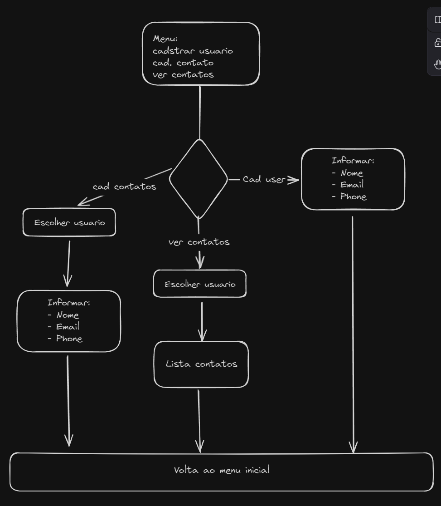

## Contact Book

- Goals:
  1.  Create a tool that is able to register users, and some contacts for each user
      - Should work in CLI
      - Should use menus to navigate the interface
      - Should save the data in a JSON file (at first)
      - Should implement an adapter that would be able to easily switch from JSON to any DB
  1.  Practice basic Rust skills while learning it

## Improvements identified to be done in the short term on the current code

- [x] Add a Contact similar to a User, but without the contact field (check if there any short syntax for that)

- [x] Change the structure from Vec<User> to a HashMap<User, Vec\<Contact\>>

- [ ] Make the functions propagate the errors, to be treated where its called, this way will make testing easier

- [ ] Add tests

- [x] When listing users and contacts, make it able to select in a menu which user you want to select and see the respective contact list

- [x] Check how to enable to keep a selected user highlited in the same poisition in the terminal, and then all future commands will work with this user already select, like creating a state for the selected user

## Initial Design (It will be translated and modified)

